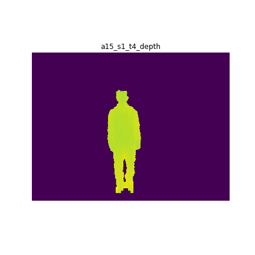
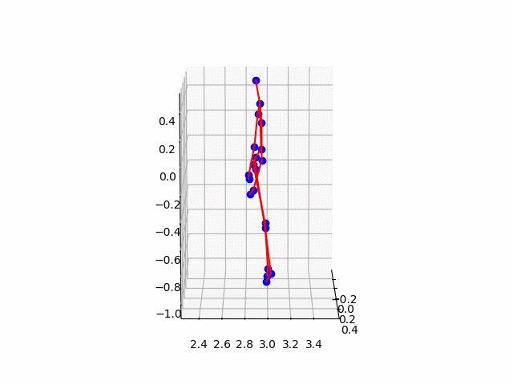
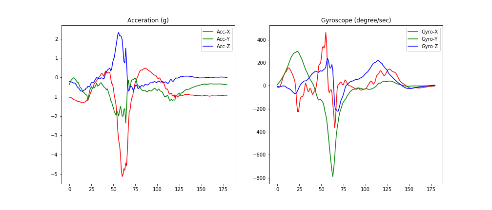

# Multi-modal Human Actions
In this repo, we would analyze the open source human action regonition data from UT Dallas (data provided [here](https://www.utdallas.edu/~kehtar/UTD-MHAD.html))

# About the Dataset
The naming convention of a file is "ai_sj_tk_modality", where ai stands for action number i, sj stands for subject number j, tk stands for trial k, and modality corresponds to four data modalities (color, depth, skeleton, inertial).

## Depth Data
The depth data is a `(240, 320, 55) WidthxHeightxFrames matrix`.  
Each frame contains an image  
Example of the depth data looks like this  

## Skeleton Data
Each skeleton data is a `20 x 3 x num_frame matrix`.  
Each row of a skeleton frame corresponds to three spatial coordinates of a joint.  
The skeleton joint order in UTD-MAD dataset:
1. head 
2. shoulder_center
3. spine
4. hip_center
5. left_shoulder
6. left_elbow
7. left_wrist
8. left_hand
9. right_shoulder
10. right_elbow
11. right_wrist
12. right_hand
13. left_hip
14. left_knee
15. left_ankle
16. left_foot
17. right_hip
18. right_knee
19. right_ankle
20. right_foot

Example of the skeleton data looks like this  

## Inertial Data

